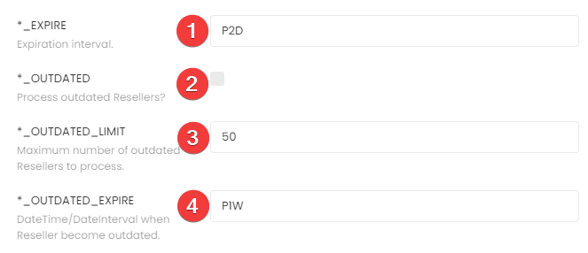

# Current implementation

## Jobs

### Importers

These jobs load all objects from Cosmos and needed only for one time while initial loading (in this case they must be run in order as in the table) or if you want to update all objects.

| Job                                    | Parallel? | 
|----------------------------------------|-----------|
| `ep-data-loader-distributors-importer` | No        |
| `ep-data-loader-resellers-importer`    | No        |
| `ep-data-loader-customers-importer`    | No        |
| `ep-data-loader-assets-importer`       | No        |
| `ep-data-loader-documents-importer`    | No        |

### Synchronizers

These jobs create new, update existing, delete removed objects and they are required to sync changes with Cosmos.

| Job                                        | Parallel? | 
|--------------------------------------------|-----------|
| `ep-data-loader-distributors-synchronizer` | No        |
| `ep-data-loader-resellers-synchronizer`    | No        |
| `ep-data-loader-customers-synchronizer`    | No        |
| `ep-data-loader-assets-synchronizer`       | No        |
| `ep-data-loader-documents-synchronizer`    | No        |

All jobs have the following workflow:


with two steps:

1) Sync objects: load all new/update existing objects from Cosmos (execute always) and create/update them;
2) Sync outdated objects: check outdated objects (= objects that were not synced for a while) from the database and update/delete them;

To control which objects should be processed on each step, the service has a few settings:



| #   | Setting           | Description                                                                                          |
|-----|-------------------|------------------------------------------------------------------------------------------------------|
| 1   | `EXPIRE`          | Expiration interval.                                                                                 |
| 2   | `OUTDATED`        | Outdated objects will be processed only if enabled.                                                  |
| 3   | `OUTDATED_LIMIT`  | Maximum number of outdated objects to process. Be careful, it may create a lot of queries to Cosmos. |
| 4   | `OUTDATED_EXPIRE` | Outdated interval.                                                                                   |


## Commands

There are also a few commands that allow to import/update objects, please use following command to find all of them:

```shell
php artisan list | grep ep:data-loader
```

## Limitations/Issues/Notes

1. DataLoader doesn't delete Distributor/Resellers/Customers/Assets/Documents if they no longer exist in Cosmos, it just writes an error into the logs if possible. Current realization cannot find deleted Distributor/Resellers/Customers. Assets can be found only while processing Reseller/Customer;
2. DataLoader skips Locations without zip and/or city;
3. Asset may be placed on:
    * Customer Location
    * Reseller Location (if Customer doesn't have required location)
    * Asset location (if Reseller doesn't have required location)
