# Keycloak

## Important notes

1. Users can Sign In only if local account with roles and permissions exist. The restriction introduced because of inability to match Keycloak scopes from token and organizations (the token contains all scopes from all organizations where the user is the member of).
2. To sync users we are using a custom endpoint `/custom/users` that returns User with groups.
3. The custom `reseller_access`/`customer_access` claim required to determine current organization.

## Application setup (`.env`)

| Setting                             | Description                         |
|-------------------------------------|-------------------------------------|
| `EP_KEYCLOAK_URL`                   | Keyclock URL                        |
| `EP_KEYCLOAK_REALM`                 | Realm name                          |
| `EP_KEYCLOAK_CLIENT_ID`             | Client ID                           |
| `EP_KEYCLOAK_CLIENT_UUID`           | Client UUID                         |
| `EP_KEYCLOAK_CLIENT_SECRET`         | Client Secret                       |
| `EP_KEYCLOAK_ENCRYPTION_PUBLIC_KEY` | Public key                          |
| `EP_KEYCLOAK_ORG_ADMIN_GROUP`       | [OrgAdmin/Owner Group UUID](#group) |

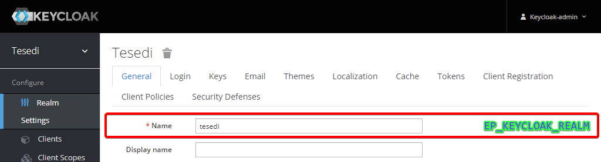
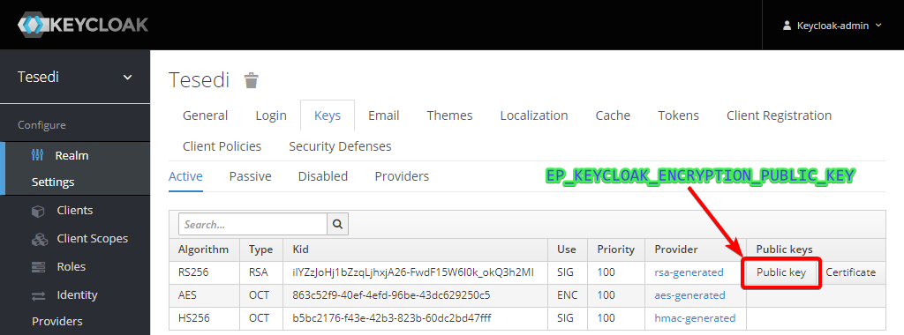
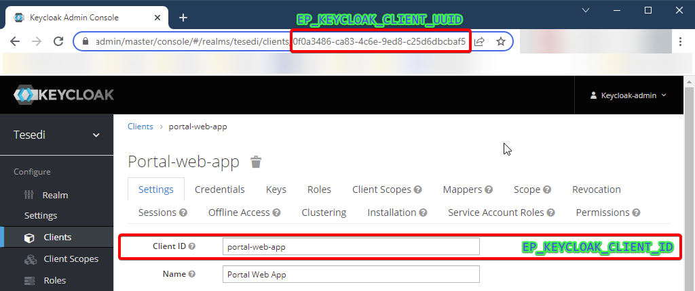
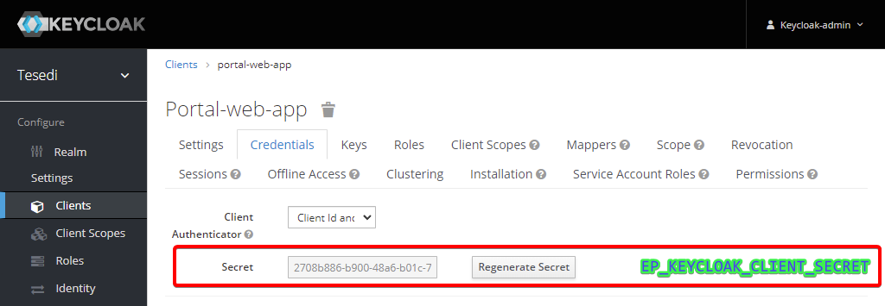

## Realm settings

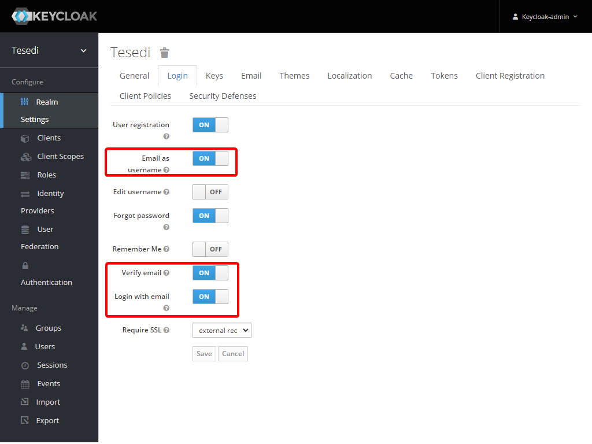

## Client Settings

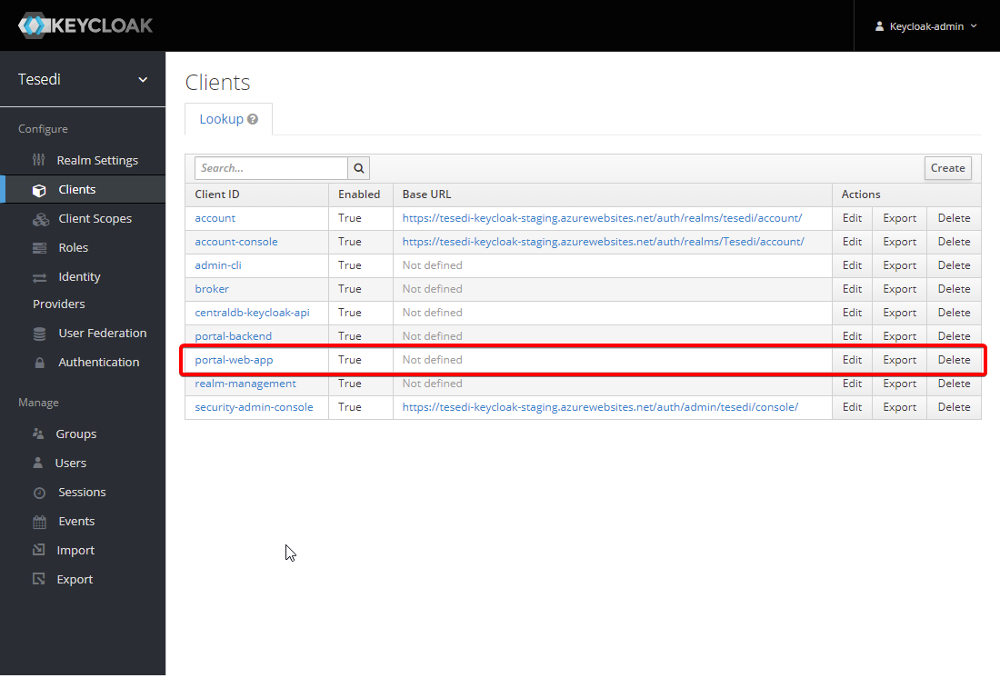

### Settings

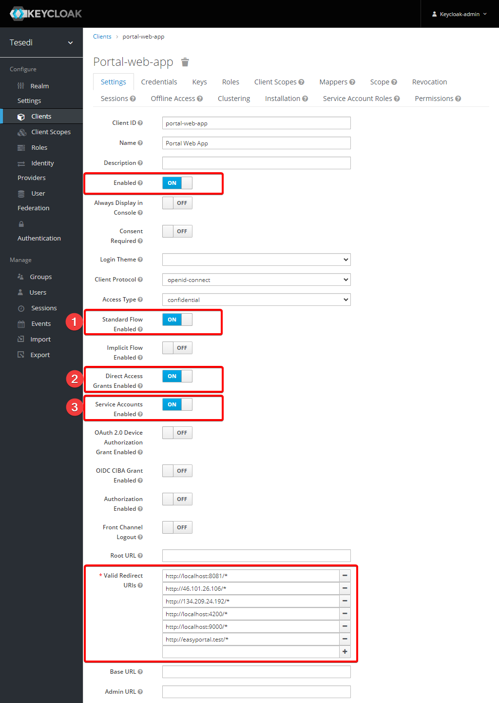

1. Required for Reseller Sign In
2. Required for Customer Sign In
3. Required to manage Users

### Service Account Roles

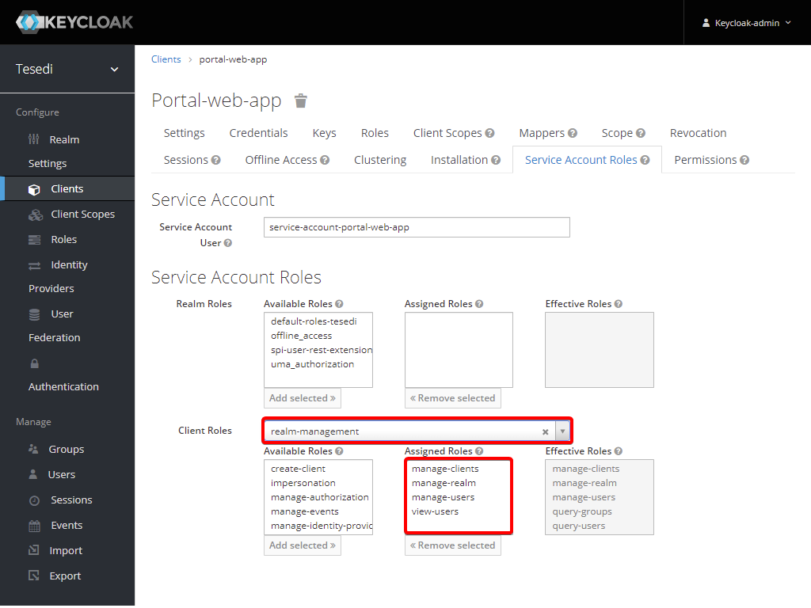

* `manage-clients` - required to update Roles (= permissions)
* `manage-realm` - required to update Groups (= roles)
* `view-users`, `manage-users` - required to sync/update Users

### Mappers

While Sing In the application will update user properties from Access Token claims. Claims can be added as mappers from "Client Scopes" section or in "Client" settings. Application supports the following claims and the recommended setup is:

| Claim                    | Client Scope | Mapper Name           | Mapper Type    | Property              | Claim JSON Type |
|--------------------------|--------------|-----------------------|----------------|-----------------------|-----------------|
| `enabled`                |              | enabled               | User Property  | `enabled`             | boolean         |
| `email`ᴿᴰ                | email        | email                 | User Property  | `email`               | string          |
| `email_verified`ᴰ        | email        | email verified        | User Property  | `emailVerified`       | boolean         |
| `given_name`ᴿᴰ           | profile      | given name            | User Property  | `firstName`           | string          |
| `family_name`ᴿᴰ          | profile      | family name           | User Property  | `lastName`            | string          |
| `locale`ᴰ                | profile      | locale                | User Attribute | `locale`              | string          |
| `photo`                  | profile      | photo                 | User Attribute | `photo`               | string          |
| `job_title`              | profile      | job_title             | User Attribute | `job_title`           | string          |
| `mobile_phone`           | profile      | mobile_phone          | User Attribute | `mobile_phone`        | string          |
| `office_phone`           | profile      | office_phone          | User Attribute | `office_phone`        | string          |
| `title`                  | profile      | title                 | User Attribute | `title`               | string          |
| `contact_email`          | profile      | contact_email         | User Attribute | `contact_email`       | string          |
| `academic_title`         | profile      | academic_title        | User Attribute | `academic_title`      | string          |
| `homepage`               | profile      | homepage              | User Attribute | `homepage`            | string          |
| `timezone`               | profile      | timezone              | User Attribute | `timezone`            | string          |
| `company`                | profile      | company               | User Attribute | `company`             | string          |
| `phone_number`ᴰ          | phone        | phone number          | User Attribute | `phoneNumber`         | string          |
| `phone_number_verified`ᴰ | phone        | phone number verified | User Attribute | `phoneNumberVerified` | boolean         |

Legend:
* ᴿ - required
* ᴰ - default (= no action required)

Mapper defaults:
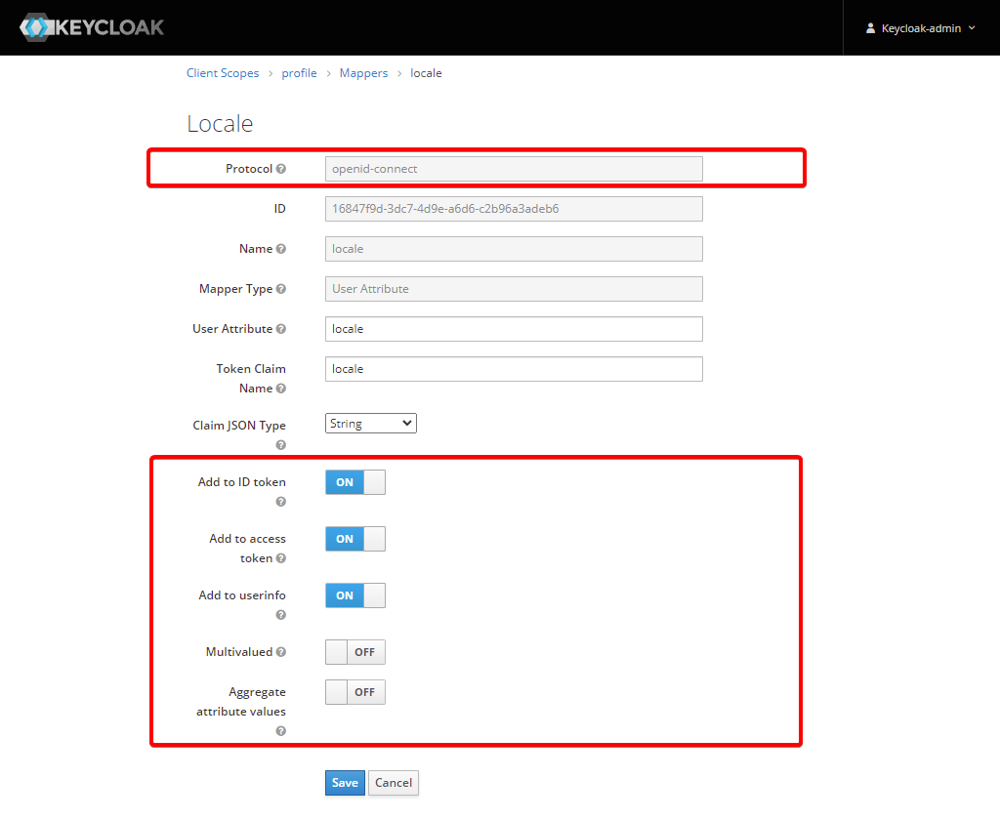

To check current claims available in Assess Token you can "Evaluate" feature in the Client settings:

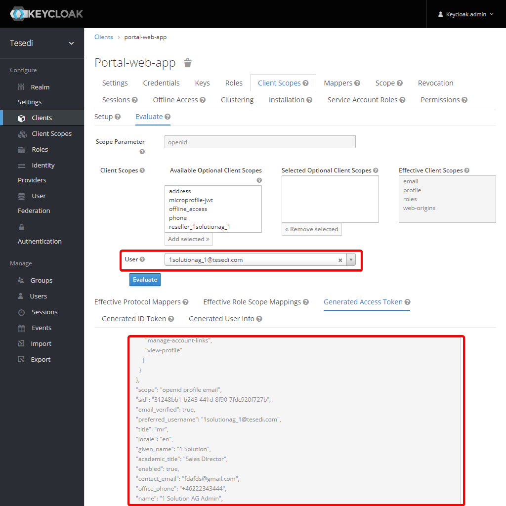

## OrgAdmin/Owner Group 

The group is required and users related to this group will have all permissions on their organization(s). The name of the group doesn't matter. UUID should be assigned to `EP_KEYCLOAK_ORG_ADMIN_GROUP` setting.

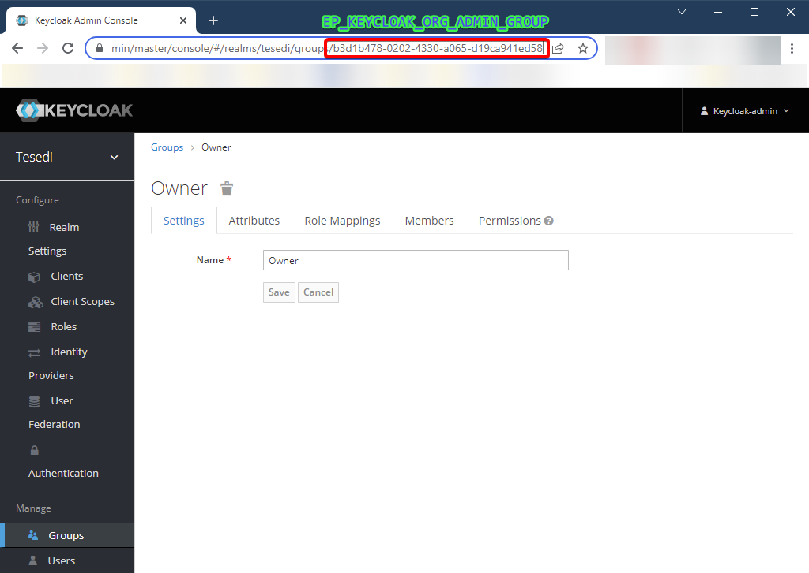

## Next

After the setup it is recommended to run following commands:

* `php artisan ep:keycloak-permissions-sync` to sync permissions
* `php artisan ep:keycloak-users-sync` to sync users

## Troubleshooting

### JWT token validation failed

1. Check that `EP_KEYCLOAK_ENCRYPTION_PUBLIC_KEY` is set and has a valid value
2. Check the time on Keycloak server and on app server. If the time differs, the recommended way is to fix/sync time. If it is not possible or the problem is not gone, you can try to set `EP_KEYCLOAK_LEEWAY=PT5S`, but the value should not be greater than a few seconds. 
